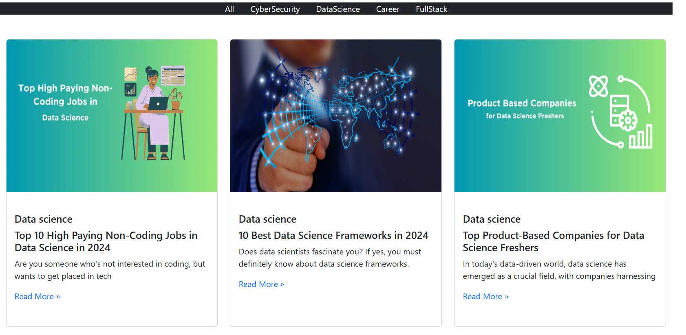

## 📚 router (Blog Category Filter App)

A simple React app that displays blog posts and allows filtering by category using React Router.

---

## 🚀 Features

View all posts or filter by category (All, Cyber Security, Data Science, Career, Full Stack)

Single Page Application (SPA) navigation without reloads

Responsive design using Bootstrap grid

Reusable Card component for all categories

---

## 📂 Project Structure
router/
│── public/              # Static files
│── src/
│   ├── pages/
│   │   ├── All.jsx
│   │   ├── CyberSecurity.jsx
│   │   ├── Card.jsx
│   │   ├── DataScience.jsx
│   │   ├── Career.jsx
│   │   └── FullStack.jsx
│   ├── App.jsx          # Routes setup
│   ├── main.jsx         # Entry point
│   └── data.js          # Blog data array
│── package.json
│── README.md

---

📖 Usage

1. Navigate through categories using the navbar.

2. Filter posts instantly without page reloads.

3. Responsive layout for desktop & mobile.

## 📸 Screenshots
💻 Desktop View :



📱 Mobile View:


---

📦 Installation & Setup
Clone the repository
```bash
git clone https://github.com/Elanthiran/router.git
cd router
```
---

Install dependencies
```bash
npm install
```

Start development server
```bash
npm run dev
```
---

## 🛠️ Tech Stack

- React

- React Router DOM

- Bootstrap

- JavaScript (ES6+)


## 💡 Future Improvements

- Fetch blog data from an API instead of hardcoded array

- Add search functionality

- Implement pagination for large datasets

- Include category counts in navigation

- Add animations for page transitions
  
---
## 🤝 Contributing

Contributions are welcome!

- Fork the repo

- Create your feature branch (git checkout -b feature/new-feature)

- Commit changes (git commit -m 'Add new feature')

- Push to branch (git push origin feature/new-feature)

- Open a Pull Request

---

## 📜 License

This project is open-source under the MIT License.
